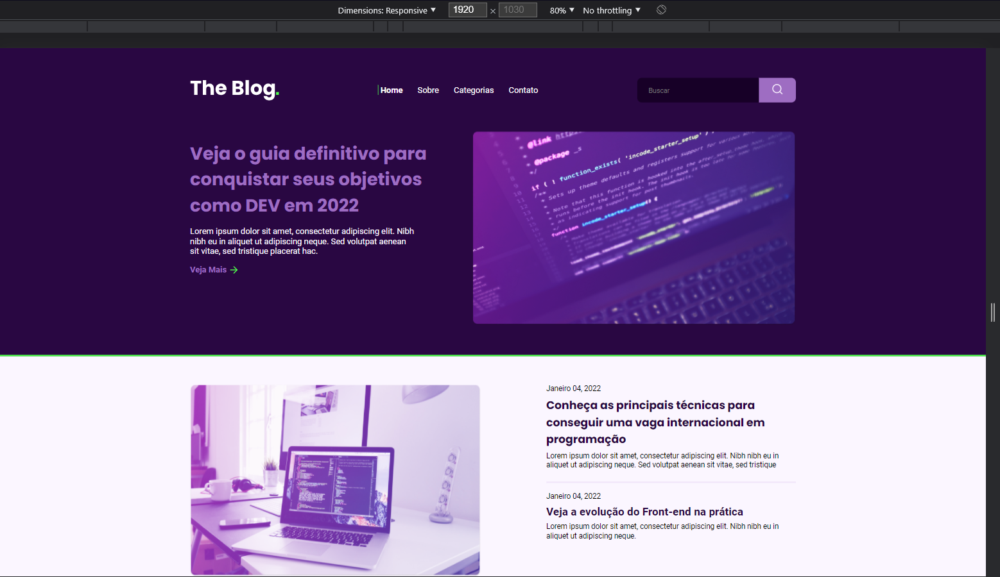
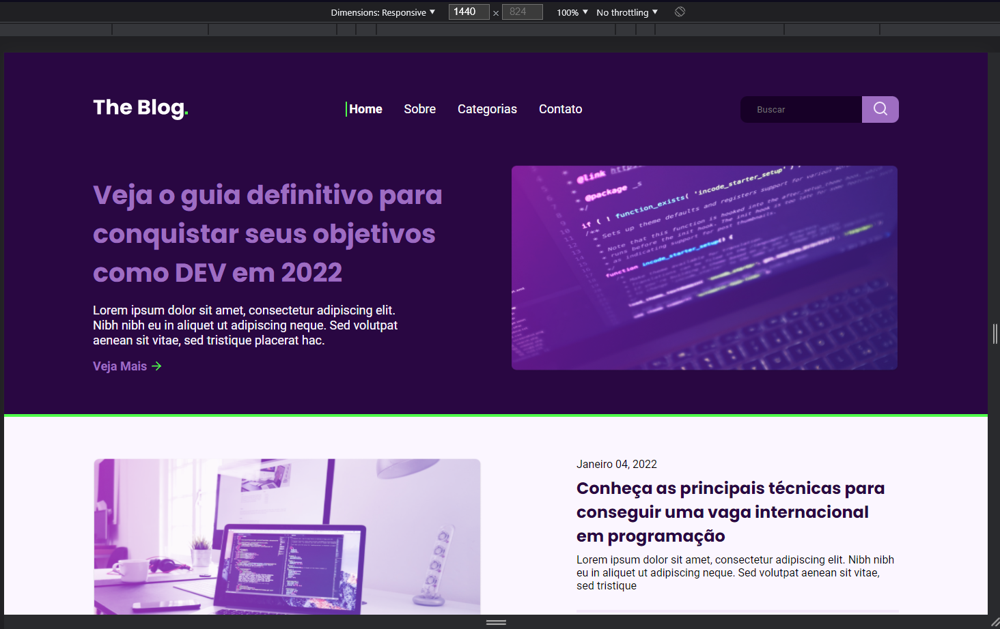
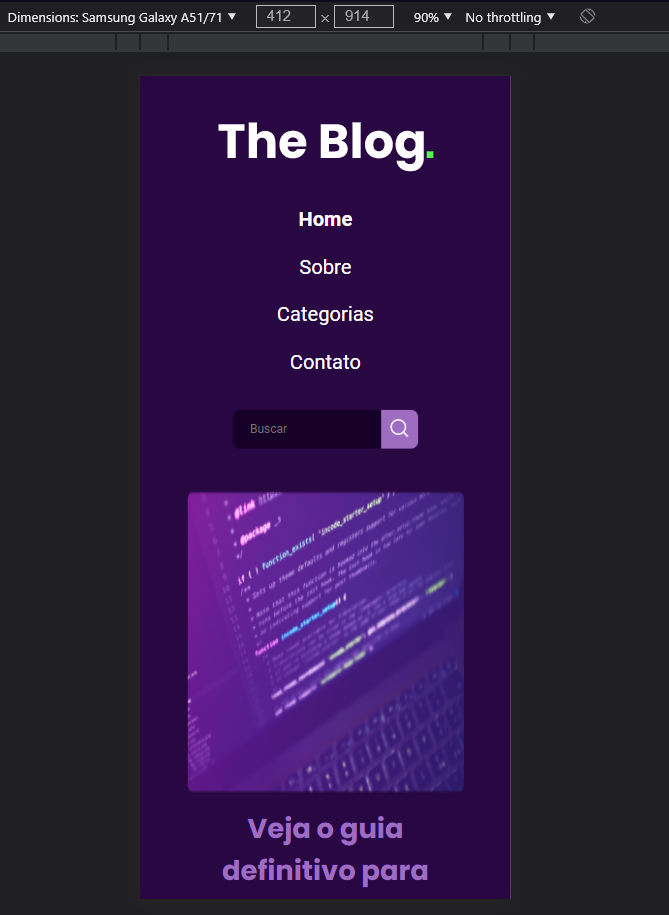

# The Blog - RocketBlog

     

## O Projeto

Desafio RocketBlog disponibilizado pela Rocketseat

## Funcionamento

Criação de uma página para blog

### Responsividade

O autor buscou criar responsividade para que o blog você usado em qualquer tela, como exemplo:

#### 1920px

#### 1440px

#### 1024px

#### 930px

#### 412px

